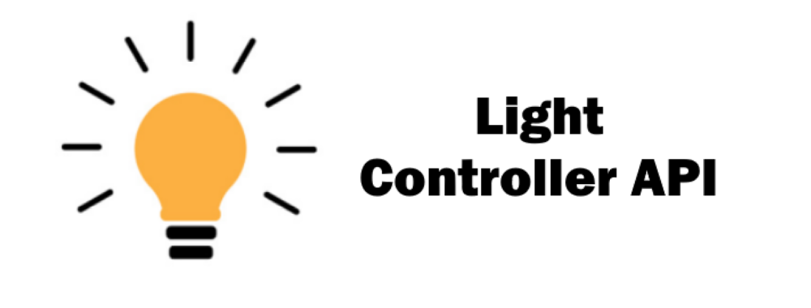

<a href="https://playlegend.net"></a>

[](https://jitpack.io/#IBims1ckoky/LightControllerAPI)
[](https://github.com/IBims1ckoky/LightControllerAPI/issues)

# LightControllerAPI

This is an easy to use **LightControllerAPI** in for Java to control Lights from [PhillipsHue](https://www.philips-hue.com/).


# How to get started

Gradle (Default):
```gradle
repositories {
   maven { url 'https://jitpack.io' }
}

dependencies {
   implementation 'com.github.IBims1ckoky:LightControllerAPI:master-SNAPSHOT'
}
```
  
Maven:
```maven
<repositories>
   <repository>
     <id>jitpack.io</id>
     <url>https://jitpack.io</url>
   </repository>
</repositories>
  
<dependencies>
  <dependency>
     <groupId>com.github.IBims1ckoky</groupId>
     <artifactId>LightControllerAPI</artifactId>
     <version>master-SNAPSHOT</version>  
  </dependency>
</dependencies>
```

## Visit the Wiki!

### How to get started
* [Hardware Requirements](https://github.com/IBims1ckoky/LightControllerAPI/wiki/Hardware-Requirements)
* [Maven & Gradle](https://github.com/IBims1ckoky/LightControllerAPI/wiki/Maven-&-Gradle)
* [Important Information](https://github.com/IBims1ckoky/LightControllerAPI/wiki/Important-Information)
### BridgeAPI
* [BridgeIP](https://github.com/IBims1ckoky/LightControllerAPI/wiki/BridgeIP)
* [Username & Clientkey](https://github.com/IBims1ckoky/LightControllerAPI/wiki/Username-&-Clientkey)
* [Bridge Informations](https://github.com/IBims1ckoky/LightControllerAPI/wiki/Bridge-Informations)
* [Bridge Scanner](https://github.com/IBims1ckoky/LightControllerAPI/wiki/BridgeScanner-(Credentials))
### LampAPI
* [Get All Lamps](https://github.com/IBims1ckoky/LightControllerAPI/wiki/Get-All-Lamps)
* [Lamp by Name](https://github.com/IBims1ckoky/LightControllerAPI/wiki/Lamp-by-Name)
* [Lamp Brightness](https://github.com/IBims1ckoky/LightControllerAPI/wiki/Lamp-Brightness)
* [Turn Lamps On & Off](https://github.com/IBims1ckoky/LightControllerAPI/wiki/Turn-Lamps-On-&-Off)
* [Other Updates]()